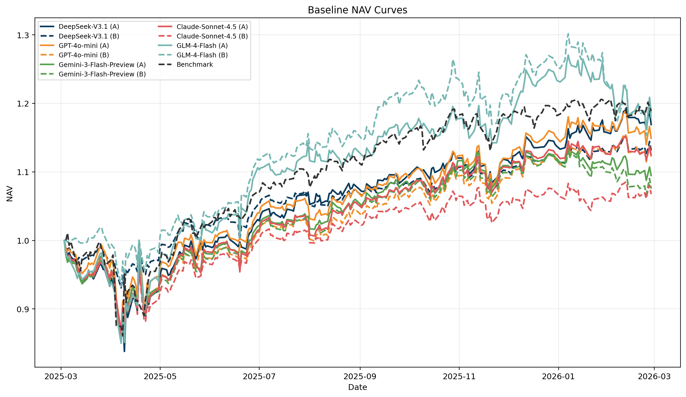
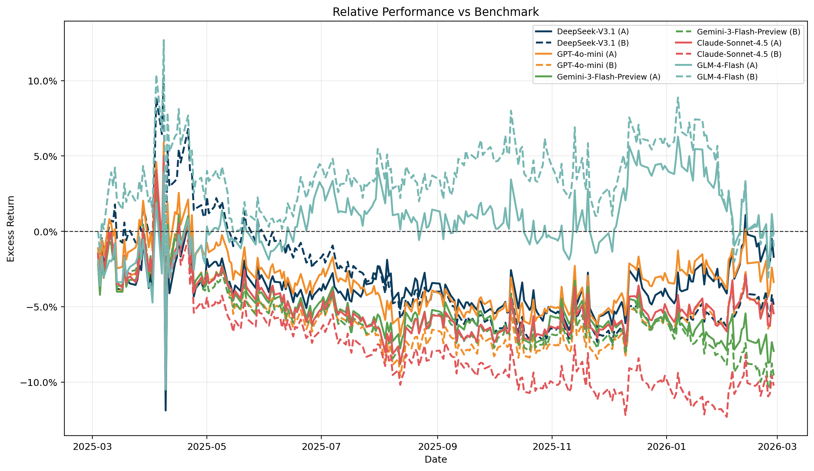
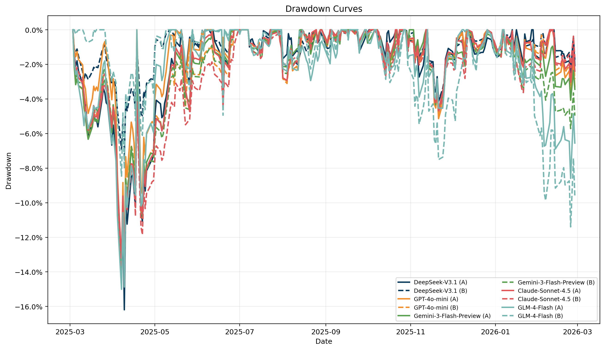
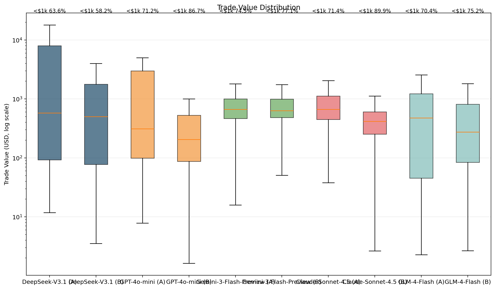
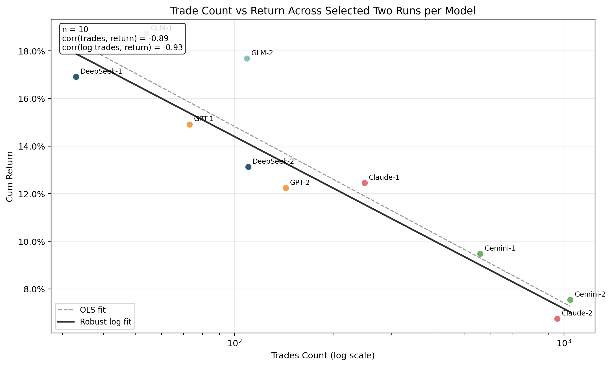
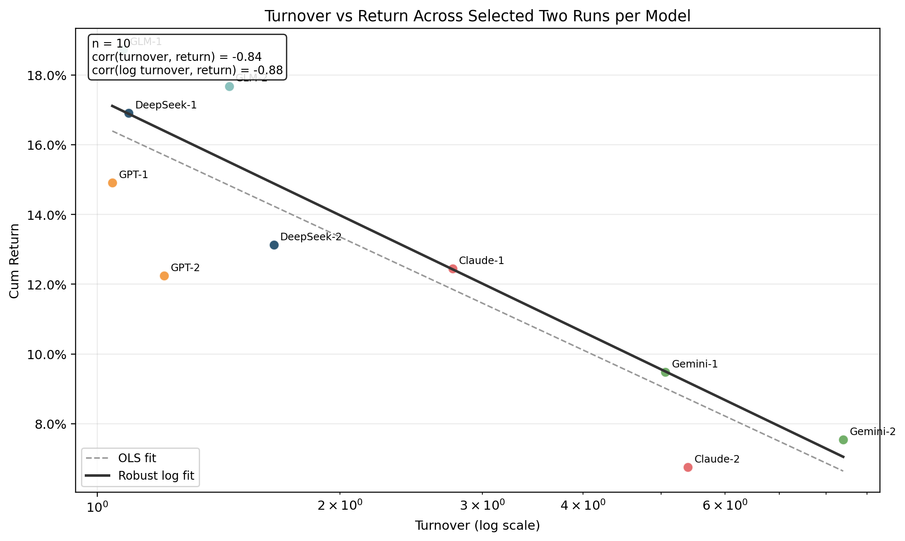
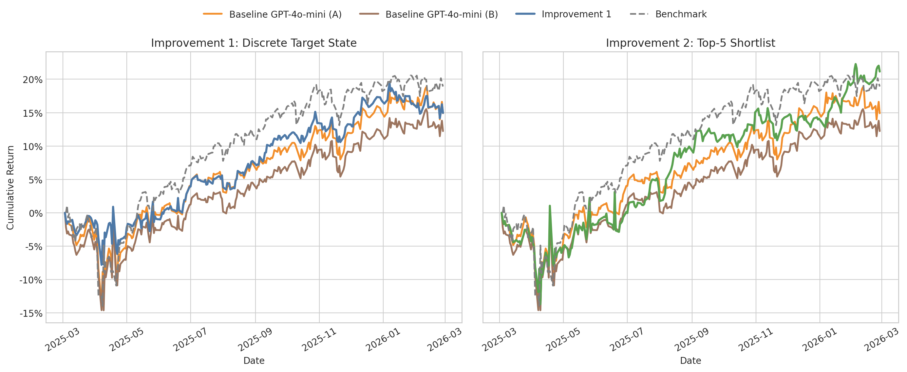

# Trading Agent 评测与 Workflow 改进

## 0. 研究问题

- LLM-based Trading Agent 在日频新闻驱动交易里，是否具备稳定超额收益能力？
- 如果暂时没有，失效原因来自哪里，如何通过提高对workflow约束进行改善？

## 1. 实验设定与主要评测结果

Workflow 参考 Stockbench 中的 Trading Agent 结构。Baseline 部分统一采用 `2025-03-01` 到 `2026-02-28` 的一年回测区间，对照 benchmark 为定投标准普尔 500 指数，其年度收益为 `18.92%`。实验覆盖 `5` 个模型、每个模型 `2` 条完整年度 run，共 `10` 条正式结果。

根据官方 tech report 的介绍，五个模型的知识截止时间如下，均早于实验起始时间。

| 模型 | 知识截止日期 |
| --- | :---: |
| DeepSeek-V3.1 | 2023-10 |
| GPT-4o-mini | 2023-10 |
| Gemini-3-Flash-Preview | 2023-10 |
| Claude-Sonnet-4.5 | 2024-06 |
| GLM-4-Flash | 2023-10 |

五个模型、两次完整年度 run 的正式结果如下。

| 模型 | 累计收益率 | 超额收益率 | 最大回撤 | Sharpe | Sortino | 交易次数 |
| --- | ---: | ---: | ---: | ---: | ---: | ---: |
| DeepSeek-V3.1 (A) | 16.91% | -0.56% | -16.19% | 0.801 | 0.060 | 33 |
| DeepSeek-V3.1 (B) | 13.13% | -5.12% | -7.29% | 1.039 | 0.088 | 110 |
| GPT-4o-mini (A) | 14.91% | -2.40% | -13.77% | 0.726 | 0.056 | 73 |
| GPT-4o-mini (B) | 12.24% | -3.86% | -14.60% | 0.610 | 0.047 | 143 |
| Gemini-3-Flash-Preview (A) | 9.48% | -6.57% | -14.45% | 0.556 | 0.044 | 557 |
| Gemini-3-Flash-Preview (B) | 7.55% | -8.47% | -14.23% | 0.461 | 0.036 | 1045 |
| Claude-Sonnet-4.5 (A) | 12.45% | -4.74% | -13.32% | 0.744 | 0.059 | 248 |
| Claude-Sonnet-4.5 (B) | 6.75% | -9.66% | -14.61% | 0.435 | 0.033 | 955 |
| GLM-4-Flash (A) | 18.73% | 1.74% | -15.01% | 0.819 | 0.064 | 54 |
| GLM-4-Flash (B) | 17.68% | -1.30% | -11.40% | 0.904 | 0.076 | 109 |

## 2. 实验结果与决策机制分析

本节总结实验结果并做整体分析。

### 2.1 正收益能力与决策可解释性

`10` 次回测全部取得了正收益，累计收益区间为 `6.75%` 到 `18.73%`。这说明在不加入任何额外 workflow 约束时，LLM 驱动的 Trading Agent 已经能够从新闻、价格与资金状态中提取一定有效信号，并据此形成可获利的配置动作。

从风险调整收益看，LLM也具备一定投资质量。`Sharpe` 位于 `0.435` 到 `1.039`，`Sortino` 位于 `0.033` 到 `0.088`，最大回撤位于 `-7.29%` 到 `-16.19%`。

同时，LLM的决策判断在具体交易上具有一定可解释性，下面有两个例子：

#### Case A

`2025-04-15`，`Claude-Sonnet-4.5 (B)` 在 `BA` 上从空仓直接买入 `16.1` 股，成交金额约 `$2,499.93`。

在前一日的 `BA` 新闻流出现了 “`Boeing sees delivery uptick in Q1`” 和 “`Jet Set Go: Why I'm One Of Boeing's Biggest Bulls`”。

相应地，模型给出的理由包括 “`Positive news on workforce investment and resilient demand`” 以及 “`Reasonable entry point given volatility and sector outlook`”，并取得了收益。

到 `2025-05-14`，`BA` 收盘价升至 `204.72` 美元。若仅观察这笔 `2025-04-15` 的首次建仓，其买入执行价为 `155.31` 美元，对应区间收益约为 `31.84%`，单笔浮盈约 `$796.06`。

#### Case B

`2025-04-21`，`Claude-Sonnet-4.5 (B)` 在 `UNH` 上执行减仓，单次卖出 `1.75` 股，成交金额约 `$787.08`。该日缓存里的决策理由非常明确，

对资产`UNH`，其`2025-04-18`到`2025-04-21`连续三天平均下跌`5.4%`，而`2025-04-20`中的新闻流出现了：`Large price gap and volatility`,相应地，模型认为这是`Significant negative news and selloff concerns, increasing fundamental risk`。

从结果看，这次减仓同样是方向正确的。按成交价 `449.67` 美元计算，若这 `1.75` 股继续持有到 `20` 个交易日后的 `2025-05-19`，对应价格已经降至 `315.89` 美元，额外跌幅约为 `29.75%`，单就这一次卖出动作就大约避免了 `$234` 的后续损失。也就是说，模型不仅能够根据正面事件建立仓位，也能够在负面事件下识别风险并先行收缩敞口。

### 2.2 不稳定的超额收益获取能力

`10` 条 回测结果 中，只有 `GLM-4-Flash (A)` 的累计收益略高于 benchmark，对应超额收益为 `1.74%`；其余 `9` 条回测的超额收益全部为负。







因此，LLM的确能够通过新闻理解、仓位调整和组合管理拿到正收益，但这种能力还不够稳定，还不足以在一年期回测中持续地、可复现地转化为超额收益。

## 3. 失效模式分析

### 3.1 Failure Mode 1: 仓位控制失稳与碎片化调仓

`10` 次回测的交易行为指标如下：

| 模型 | 有交易天数 | 有交易天数占比 | 年度换手率 | 单笔交易中位数 | 交易金额 CV | 小于 $1,000 的交易占比 | 日均交易笔数 |
| --- | ---: | ---: | ---: | ---: | ---: | ---: | ---: |
| DeepSeek-V3.1 (A) | 13 | 5.16% | 1.09x | $579 | 1.42 | 63.64% | 0.13 |
| DeepSeek-V3.1 (B) | 37 | 14.68% | 1.66x | $502 | 1.53 | 58.18% | 0.44 |
| GPT-4o-mini (A) | 33 | 13.10% | 1.04x | $312 | 1.35 | 71.23% | 0.29 |
| GPT-4o-mini (B) | 61 | 24.21% | 1.21x | $205 | 1.86 | 86.71% | 0.57 |
| Gemini-3-Flash-Preview (A) | 206 | 81.75% | 5.06x | $664 | 1.00 | 74.51% | 2.21 |
| Gemini-3-Flash-Preview (B) | 245 | 97.22% | 8.40x | $630 | 0.86 | 77.13% | 4.15 |
| Claude-Sonnet-4.5 (A) | 88 | 34.92% | 2.76x | $667 | 1.23 | 71.37% | 0.98 |
| Claude-Sonnet-4.5 (B) | 226 | 89.68% | 5.40x | $417 | 1.22 | 89.95% | 3.79 |
| GLM-4-Flash (A) | 30 | 11.90% | 1.08x | $477 | 2.15 | 70.37% | 0.21 |
| GLM-4-Flash (B) | 63 | 25.00% | 1.46x | $274 | 1.98 | 75.23% | 0.43 |

观察到以下不足：

1. 单笔交易金额普遍偏小，例如 `GPT-4o-mini (B)` 与 `GLM-4-Flash (B)`，其单笔交易中位数只有 `$205` 与 `$274`。
2. 小额交易占比过高，正文 `10` 条 run 中有 `8` 条 run 的 `$1,000` 以下交易占比超过 `70%`
3. 交易金额尺度缺乏一致性，例如`GPT` 与 `GLM` 的总交易金额明显偏高，在几百美元和数千美元之间来回跳变，而不是形成固定的仓位控制规则。



可见，LLM 用自然语言推断去直接决定连续仓位，这给了LLM过大的自由度，产生了低质量的投资组合调整。

#### Case C

`2025-05-13` 到 `2025-05-20` 的 `6` 个交易日里，`GPT-4o-mini (B)` 在 `GS` 连续执行了 `5` 次小额买入，金额分别为 `$177.99`、`$102.65`、`$450.37`、`$85.29` 和 `$18.23`，累计不过 `$834.53`，平均每次只有 `$166.91`。但为了完成这不到 `$1k` 的仓位调整，模型却调用了 `5` 次独立决策，把持仓从 `10.15` 股缓慢推到 `11.52` 股。

### 3.2 Failure Mode 2: 事件流驱动下的过度反应

第二个失效模式是，在多股票、新闻密集、日频重决策的环境里，baseline 容易对同一类事件流持续反应，最终表现为交易次数过多、换手率过高，而这些额外动作并没有带来更好的收益。

正文 `10` 条 run 上，`log(trades_count)` 与 `cum_return` 的相关系数约为 `-0.93`。



这种趋势在每个模型家族内部都成立：DeepSeek 从 `33` 笔交易增加到 `110` 笔时，收益从 `16.91%` 下降到 `13.13%`；GPT 从 `73` 笔上升到 `143` 笔时，收益从 `14.91%` 降到 `12.24%`；Gemini 从 `557` 笔升到 `1045` 笔时，收益从 `9.48%` 降到 `7.55%`；Claude 从 `248` 笔升到 `955` 笔时，收益从 `12.45%` 降到 `6.75%`；GLM 从 `54` 笔升到 `109` 笔时，收益也从 `18.73%` 小幅回落到 `17.68%`。

如果改用年度换手率来衡量，结论也基本一致。`10` 条 run 上，`log(turnover)` 与 `cum_return` 的相关系数约为 `-0.88`。



这一结果说明，LLM 在新闻密集环境里做了更多动作、承担了更高换手，但这些额外交易并没有转化为更高收益，反而更像是在被事件流持续牵引，产生了低质量的投资决策方向。

## 4. 两项改进方案

针对前述两个 failure modes，本文提出两项对应的 workflow 改进，并在 `GPT-4o-mini` 上进行比较。



### 4.1 输出端：交易动作离散化

原始Agent Workflow的连续金额输出格式如下：

```json
{
  "decisions": {
    "AAPL": {
      "action": "increase",
      "target_cash_amount": 8500.0,
      "reasons": [
        "Positive earnings revisions and improving 7-day momentum",
        "Current position is below desired exposure"
      ],
      "confidence": 0.81
    },
    "MSFT": {
      "action": "hold",
      "reasons": [
        "Current position is already appropriate",
        "No new catalyst justifies resizing today"
      ],
      "confidence": 0.62
    }
  }
}
```

改进后的做法是不再让模型直接报金额，而是只输出离散的 `target_state`。定义 `flat`、`pilot`、`core`、`conviction` 这四个action分别对应组合总资产的 `0%`、`4%`、`8%`、`15%`，`hold` 表示保持当前仓位不变。随后由系统侧 allocator 再把状态映射成 `target_cash_amount`，并统一处理现金比例等组合约束。

```json
{
  "decisions": {
    "AAPL": {
      "target_state": "core",
      "reasons": [
        "Positive earnings revisions and improving 7-day momentum",
        "News flow supports medium-term accumulation"
      ],
      "confidence": 0.81
    },
    "MSFT": {
      "target_state": "hold",
      "reasons": [
        "Current position already matches the appropriate exposure level",
        "Recent information does not justify a state transition"
      ],
      "confidence": 0.62
    }
  }
}
```
具体实验结果如下:

| Run | 累计收益率 | 超额收益率 | 最大回撤 | Sharpe | Sortino | 交易次数 |
| --- | ---: | ---: | ---: | ---: | ---: | ---: |
| GPT-4o-mini (A) | 14.91% | -2.40% | -13.77% | 0.726 | 0.056 | 73 |
| GPT-4o-mini (B) | 12.24% | -3.86% | -14.60% | 0.610 | 0.047 | 143 |
| 改进1（Discrete Target State） | 14.96% | -3.10% | -7.79% | 0.897 | 0.070 | 183 |

| Run | 单笔交易金额均值 | 单笔交易中位数 | 单笔交易标准差 | 单笔交易金额方差 | 交易金额 CV |
| --- | ---: | ---: | ---: | ---: | ---: |
| GPT-4o-mini (A) | $1,520 | $312 | $2,056 | 4.23e6 | 1.35 |
| GPT-4o-mini (B) | $877 | $205 | $1,628 | 2.65e6 | 1.86 |
| 改进1（Discrete Target State） | $1,896 | $746 | $1,796 | 3.23e6 | 0.95 |

1. 离散化动作累计收益率为 `14.96%`，与连续动作平均高 `1.5%`左右
2. 离散化动作显著改善了风险调整后的收益质量：最大回撤从 `-13.77%`、`-14.60%` 收窄到 `-7.79%`，Sharpe 提升到 `0.897`，相对连续动作的两次回测分别提升约 `23.6%` 和约 `47.1%`。
3. 离散化动作明显改善了仓位表达的稳定性。交易金额从 baseline A 的 `1.35` 和 baseline B 的 `1.86` 下降到 `0.95`，降幅分别约为 `30.0%` 与 `48.9%`；单笔交易中位数则提升到 `$746`，说明动作不再集中在几百美元的碎片化微调上。

综上所述，将连续的仓位动作离散化可以使得仓位表达更规整，在保持收益率的情况下使得风险更加可控。

### 4.2 输入端：资产预筛选

在workflow中增加一个轻量级的预筛选层。系统会先为每只股票计算一个“今天是否值得重点处理”的优先级分数，分数高的股票说明它们更可能真的需要动作，分数低的股票说明它们当天更像是“信息不足，先不要动”。当前实现里，这个分数主要由以下信息加权组成：已有仓位、新闻条数、新闻方向性、近期价格波动、波动率、价格区间极值位置、最近一次决策是否活跃，以及持仓天数。

随后，只有得分最高的K只股票会进入后续的 decision agent，接受完整的交易判断；其余未进入 shortlist 的股票默认沿用 `hold`。

对应的简化 workflow 可以概括为：

```text
全股票池输入
-> news agent对每只股票做一次轻量级优先级打分
-> 只保留得分最高的 Top-5 股票进入 decision agent
-> Top-K 内的股票做完整交易决策
-> Top-K 外的股票不重决策，默认保持 hold
```

使用K=5，实验结果如下：

| Run | 累计收益率 | 超额收益率 | 最大回撤 | Sharpe | Sortino | 交易次数 |
| --- | ---: | ---: | ---: | ---: | ---: | ---: |
| GPT-4o-mini (A) | 14.91% | -2.40% | -13.77% | 0.726 | 0.056 | 73 |
| GPT-4o-mini (B) | 12.24% | -3.86% | -14.60% | 0.610 | 0.047 | 143 |
| 改进2（Top-5 Shortlist） | 21.16% | 2.39% | -13.68% | 0.929 | 0.071 | 34 |

从收益结果看，TopK标的预筛选后，累计收益率达到 `21.16%`，相比不进行筛选平均提高了`8.73%`，相对于 benchmark 也获得了 `2.39%` 的正超额收益。

从交易行为看，交易次数降到 `34` 次，减少了 `53.4%`到`76.2%`。Sharpe 提升到 `0.929`，相对提升约 `27.9%` 和 `52.2%`；Sortino 提升到 `0.071`，相对提升约 `26.2%` 和 `50.5%`。最大回撤则保持在 `-13.68%`，与之前基本持平。

## 5. 后续计划

1. 扩大实验范围。
2. 在现有 workflow 基础上继续引入 `majority voting`、`reflection` 等推理增强机制，希望进一步提升决策质量。
3. 整理论文写作。
