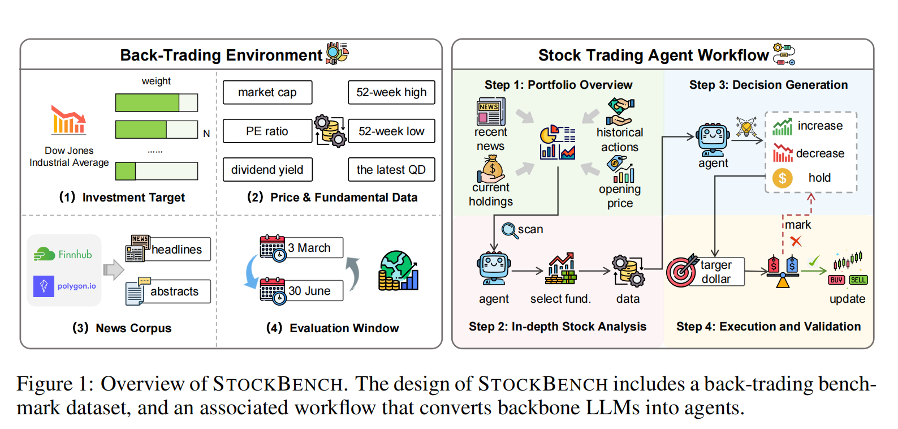
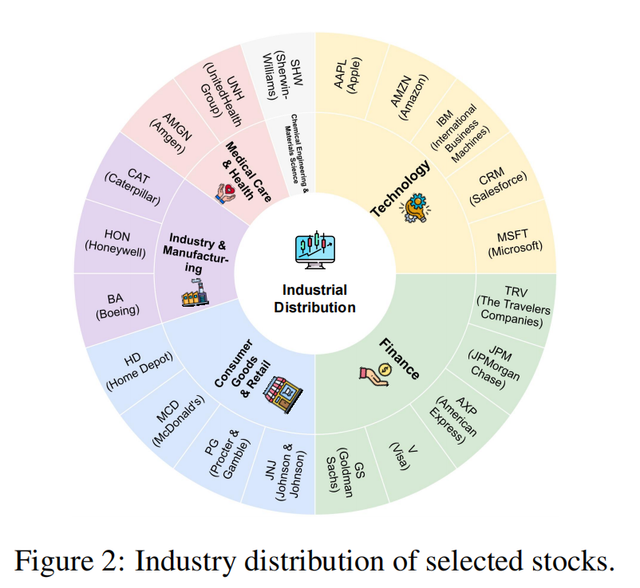

<div align="center">

# An LLM-Powered Stock Trading Benchmark Platform
<p align="center">
  <a href="https://stockbench.github.io/">Website</a> •
  <a href="https://arxiv.org/abs/2510.02209">Paper</a> •
  <a href="https://github.com/ChenYXxxx/stockbench">Github</a> 
</p>

[](LICENSE)
[](https://www.python.org/)
[](https://github.com/psf/black)

---



</div>

## 🎯 Overview

**StockBench** is a comprehensive benchmark platform designed to evaluate Large Language Models (LLMs) in stock trading decision-making. It simulates real-world trading scenarios using historical market data to assess investment decision quality, risk management capabilities, and return performance across different LLM models.

### ✨ Key Features

- 🌍 **Realistic Market Interaction** - Curated stocks with high-quality price, fundamental data, and timely news from Polygon & Finnhub
- 🔄 **Continuous Decision Making** - Multi-step workflow (portfolio → analysis → trade) reflecting real investor behavior
- 🔒 **Data Contamination Free** - Recent market data (post-2024) with zero overlap with LLM training corpora
### 📊 Investment Targets

<div align="center">

<p><i>StockBench Dataset Structure and Features</i></p>
</div>
We select the top 20 stocks from the Dow Jones Industrial Average (DJIA) by weight as our investment targets, ensuring diverse representation across major sectors while avoiding short-term irrational market sentiment.
---

## 🚀 Quick Start

### Installation

```bash
# Clone the repository
git clone <repository-url>
cd stockbench

# Create environment
conda create -n stockbench python=3.11
conda activate stockbench

# Install dependencies
pip install -r requirements.txt
```

### Configuration

Set up your API keys:（If you need to test other months or stocks, please set it up）

```bash
export POLYGON_API_KEY="your_polygon_api_key"
export FINNHUB_API_KEY="your_finnhub_api_key"
export OPENAI_API_KEY="your_openai_api_key"
```

> 💡 **Tip**: Free tiers available at [Polygon.io](https://polygon.io/) and [Finnhub.io](https://finnhub.io/)

### Run Backtest

Edit `scripts/run_benchmark.sh` to configure your backtest:

```bash
START_DATE="${START_DATE:-2025-03-01}"
END_DATE="${END_DATE:-2025-06-30}"
LLM_PROFILE="${LLM_PROFILE:-openai}"
```

Then run:

```bash
bash scripts/run_benchmark.sh
```

Or use command-line arguments:

```bash
bash scripts/run_benchmark.sh \
    --start-date 2025-04-01 \
    --end-date 2025-05-31 \
    --llm-profile deepseek-v3.1
```

---

## 📊 Results

Backtest results are automatically saved in `storage/reports/backtest/` with comprehensive metrics:

**Performance Metrics**
- Total Return
- Sortino Ratio
- Maximum Drawdown

---


### Custom Strategies

Extend the platform with your own trading strategies by implementing custom agents.

---

## 📚 Project Structure

```
stockbench/
├── stockbench/         # Core package
│   ├── agents/        # Trading agents
│   ├── backtest/      # Backtesting engine
│   ├── adapters/      # Data adapters
│   └── apps/          # Applications
├── scripts/           # Run scripts
├── storage/           # Data storage & reports
└── config.yaml        # Configuration file
```

---


## 📄 License

This project is licensed under the Apache 2.0 License - see the [LICENSE](LICENSE) file for details.

---

## 🙏 Acknowledgments

- [Polygon.io](https://polygon.io/) - High-quality stock market data
- [Finnhub](https://finnhub.io/) - Financial news and market data
- [OpenAI](https://openai.com/) - Powerful LLM capabilities
- All contributors to this project

---

## 📧 Contact

- 🐛 Issues: [GitHub Issues](../../issues)

---

<div align="center">

**⭐ If this project helps you, please give us a Star!**

Made with ❤️ by StockBench Team

</div>
